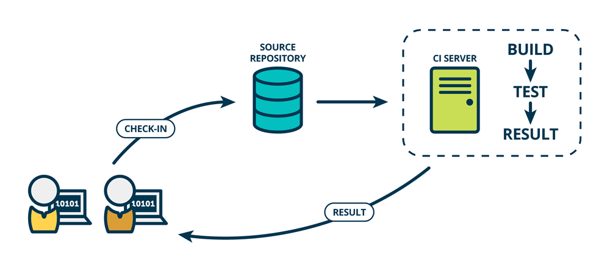
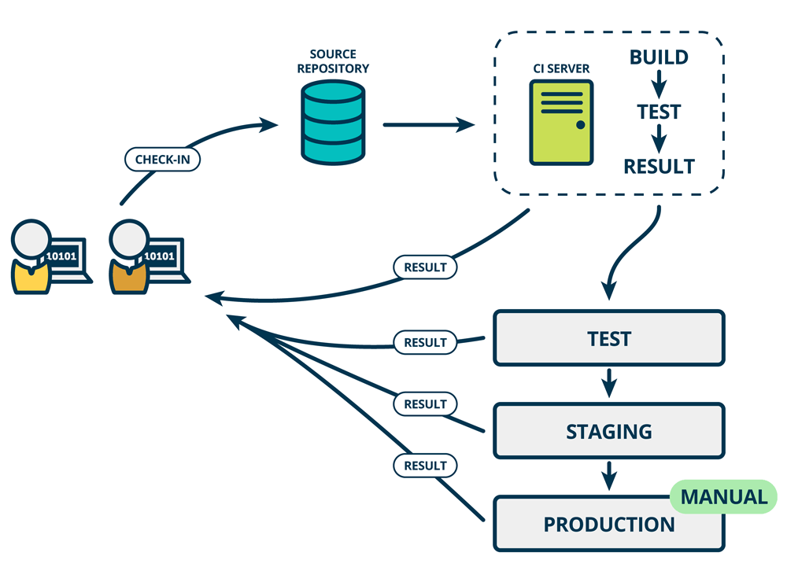
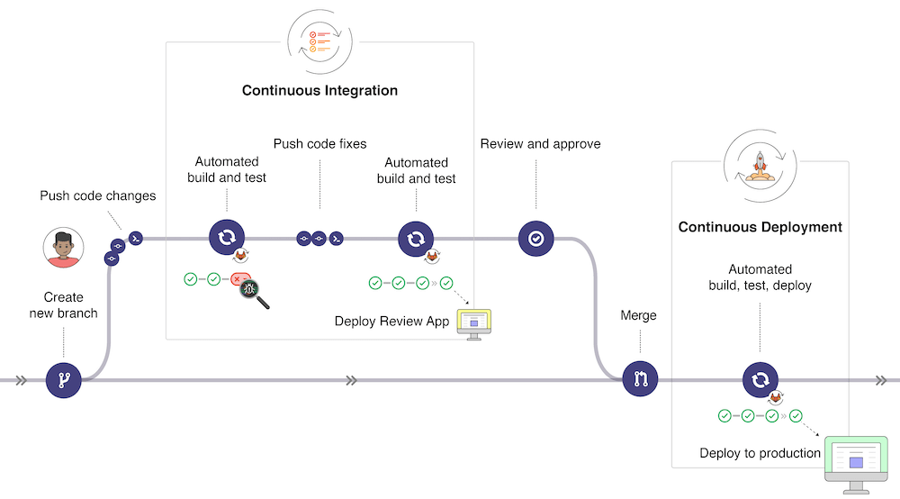

# CI/CD

## CI/CD 概念

通过软件开发的持续方法，您可以持续构建、测试和部署迭代代码更改。这个迭代过程有助于减少您基于错误或失败的先前版本开发新代码的机会。使用这种方法，从开发新代码到部署，您努力减少人为干预，甚至完全不干预。

### Continuous Integration

考虑一个应用程序，它的代码存储在 GitLab 的 Git 存储库中。开发人员每天多次推送代码更改。对于每次推送到存储库，您都可以创建一组脚本来自动构建和测试您的应用程序。这些脚本有助于减少您在应用程序中引入错误的机会。

这种做法被称为**持续集成**。提交给应用程序的每个更改，甚至是提交给开发分支的更改，都是自动且持续地构建和测试的。这些测试可确保更改通过您为应用程序建立的所有测试、指南和代码合规性标准。

使用**持续集成**作为软件开发方法，对于项目的每次推送，都会自动对代码进行一组检查（规范检查，冒烟测试，单元测试等）。

### Continuous Delivery

**持续交付**是超越**持续集成**的一步。每次将代码更改推送到代码库时，不仅会构建和测试您的应用程序，而且还会持续部署应用程序。但是，通过**持续交付**，您可以手动触发部署。

**持续交付**会自动检查代码，但需要人工干预才能手动和战略性地触发更改的部署。

### Continuous Deployment

**持续部署**是超越**持续集成**的又一步，类似于持续交付。不同之处在于，您无需手动部署应用程序，而是将其设置为自动部署（不需要人为干预）。

github CI/CD

### CI/CD 工作流程

<!--  -->

Gitlab CI/CD

